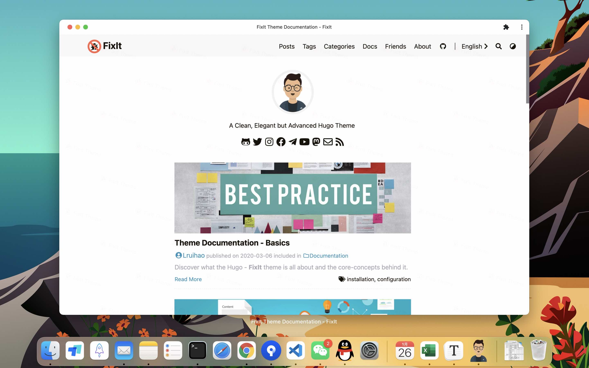

# PWA Support


Find out how to turn your FixIt site into a Progressive Web App.

<!--more-->

## What are PWAs?

[**Progressive Web Apps** (PWAs) ](https://developer.mozilla.org/en-US/docs/Web/Progressive_web_apps)are web apps that use [service workers](https://developer.mozilla.org/en-US/docs/Web/API/Service_Worker_API), [manifests](https://developer.mozilla.org/en-US/docs/Web/Manifest), and other web-platform features in combination with [progressive enhancement](https://developer.mozilla.org/en-US/docs/Glossary/Progressive_Enhancement) to give users an experience on par with native apps.

## Why bother?

Well, the straight answer to this questions is: "You don't need to turn your site into a PWA." A normal website is good enough for all the content you want to share. However, a PWA brings some extra benefits that might be useful.

1. Pages will be automatically cached by service workers when the app is installed, which enables a near-instantaneous loading from the second visit.
2. Users can always visit cached pages when they are offline.

These features may be useful for some websites, such as this documentation site. But it does not make much sense to turn a personal blog into a PWA. In the end, it all depends on your choice, and the FixIt theme will provide this feature for you anyway.

## How to turn your FixIt site into a PWA? {#setup-in-fixit}

### Configure `site.webmanifest` {#site.webmanifest}

Under the `/static/` folder, you need to create a file named `site.webmanifest`. This file provides information about your app and it is required for your app to be installable.

Here are the key values required.

* **name** *[required]*

    The name of your web app.

* **short_name** *[required]*

    A shorter name for your web app.

* **start_url** *[required]*

    The start URL of your web app. Please fill in `"/"` by default.

* **icons** *[required]*

    An array of objects representing image files will be served as application icons. You can reuse the favicon of your site as the icons.

There are other optional values you can set in the manifest file, check out this [documentation](https://developer.mozilla.org/en-US/docs/Web/Manifest) for more information.

Here is a sample `site.webmanifest` file from this documentation site.

```json
{
  "name": "FixIt Theme Documentation",
  "short_name": "FixIt Docs",
  "start_url": "/",
  "description": "A Clean, Elegant but Advanced Hugo Theme",
  "theme_color": "#ffffff",
  "background_color": "#ffffff",
  "display": "standalone",
  "icons": [
    {
      "src": "/apple-touch-icon.png",
      "sizes": "180x180",
      "type": "image/png",
      "purpose": "any maskable"
    },
    {
      "src": "/android-chrome-192x192.png",
      "sizes": "192x192",
      "type": "image/png"
    },
    {
      "src": "/android-chrome-512x512.png",
      "sizes": "512x512",
      "type": "image/png"
    }
  ]
}
```

### Configure the offline page {#offline-page}

The offline page will be served to your visitor when they are offline.

You just need to create an `offline.md` or `offline/index.md` in the `/content/` directory, and you can create them quickly with the following commands in your site directory:

```bash
hugo new offline.md
hugo new offline/index.md
# [i18n] if you are running a multilingual website.
hugo new offline/index.en.md
hugo new offline/index.zh-cn.md
hugo new offline/index.zh-tw.md
```


You need to make sure the [Permalink](https://gohugo.io/content-management/urls/#permalinks) to the offline page is `/offline/`, otherwise, you will need to modify the value of `OFFLINE_CACHE_FILES` and `OFFLINE_PAGE` in the service worker yourself.

Currently, i18n is supported for the offline page, but only for English and Chinese. Of course, you can [Contribute with a new language](https://github.com/Lruihao/FixIt/pulls) to the theme!


Here is a sample offline page.

```md
---
type: "offline"
---
```

### Enable the `enablePWA` option {#enable-pwa}

Go to `config.toml`, add or change the option `enablePWA = true` under `[params]`.

```toml
[params]
    # ...
    enablePWA = true
```

## Install your PWA

Now, an install button should show up when you visit your website and you will be able to install your site as an app. After clicking "Install", your website should be installed as a native app.



Congratulation! You have successfully turned your static site into a PWA 🎉

If you have any issues during the setup process, you can check the `Console` and `Application` panels in your browser's DevTools for debugging. Alternatively, you can check your site on [PWA Builder](https://www.pwabuilder.com/) for more information. You can also start a [discussion](https://github.com/Lruihao/FixIt/discussions) if you have any questions or propose an [issue](https://github.com/Lruihao/FixIt/issues) for any bugs you find. 
